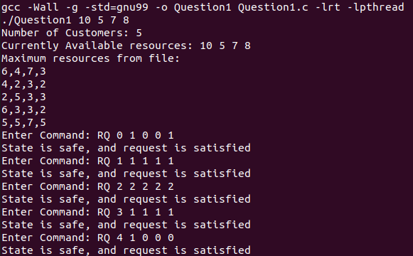
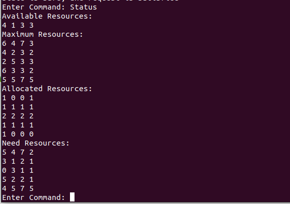
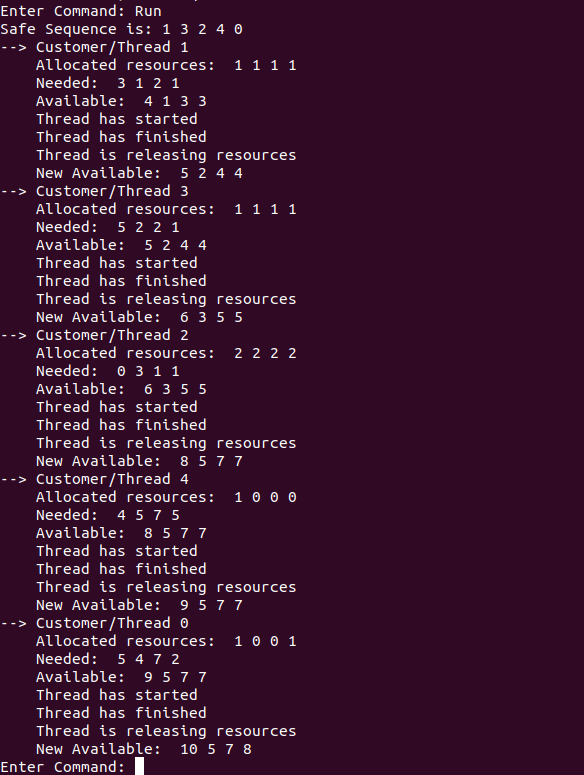
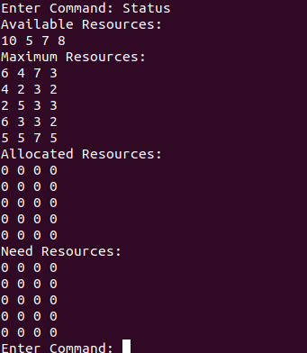
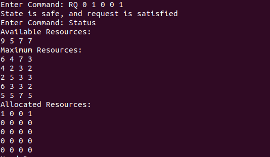
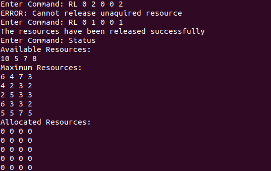

# CP386: Assignment 4
## Motivation
This is a project for CP:386 at Wilfrid Laurier University. This program simulates a Bankers algorithm, an algorithm used to avoid deadlocks in operating systems. 
## Installation
Run with provided make file, may need to change main file to Question1.c to run.
## Screenshots
Enter RQ values based on assignment outline:

View status after resources requested:

Run:

View status after resources after run:

Demo of resourceRelease, demonstraits failed and sucsessful release of a resource

## Contribution
int main(int argc, char *argv[]); -> Dhavani & Judy  
void readFile(); -> Judy  
int safetyAlgorithm(); -> Dhavani  
int resourceRequest(char *command); -> Judy  
int resourceRelease(char *command); -> Judy  
void printStatus(); -> Dhavani  
void run(); -> Dhavani  
void *runner(void *param); -> Dhavani & Judy
## Features
This program is a representation of a banker algorithm, it provides functions resourceRequest, resourceRelease, printStatus, and Run.

Execute resourceRequest with RQ followed by 5 numbers(first being process id, last four being recources to be rquested)

Execute resourceRequest with RQ followed by 5 numbers(first being process id, last four being recources to be resourceRelease)

Execute printStatus with keyword Status
  - Will show all current 2d arrays (available, Max, allocation, need)

Execute Run with keyword Run
  - This will execute customers  as  threads  in  a  safe  se
## Tests
Test code with assigment specified sequence for accurate conifration of functionality 

RQ 0 1 0 0 1

RQ 1 1 1 1 1

RQ 2 2 2 2 2

RQ 3 1 1 1 1

RQ 4 1 0 0 0
## Examples
## About Developers
* Dhavani Patel (@dhav15)
* Judy Praught (@Judy-Praught) - Had syncing issues with github, commits are less frequent (i.e. large amounts of code are added per commit)
## Credits
Dhavani Patel  
Judy Praught
## License
Copyright (c) 2021 Dhavani Patel and Judy Praught  
  
Permission is hereby granted, free of charge, to any person obtaining a copy
of this software and associated documentation files (the "Software"), to deal
in the Software without restriction, including without limitation the rights
to use, copy, modify, merge, publish, distribute, sublicense, and/or sell
copies of the Software, and to permit persons to whom the Software is
furnished to do so, subject to the following conditions:  
  
The above copyright notice and this permission notice shall be included in all
copies or substantial portions of the Software.  
  
THE SOFTWARE IS PROVIDED "AS IS", WITHOUT WARRANTY OF ANY KIND, EXPRESS OR
IMPLIED, INCLUDING BUT NOT LIMITED TO THE WARRANTIES OF MERCHANTABILITY,
FITNESS FOR A PARTICULAR PURPOSE AND NONINFRINGEMENT. IN NO EVENT SHALL THE
AUTHORS OR COPYRIGHT HOLDERS BE LIABLE FOR ANY CLAIM, DAMAGES OR OTHER
LIABILITY, WHETHER IN AN ACTION OF CONTRACT, TORT OR OTHERWISE, ARISING FROM,
OUT OF OR IN CONNECTION WITH THE SOFTWARE OR THE USE OR OTHER DEALINGS IN THE
SOFTWARE.
 
